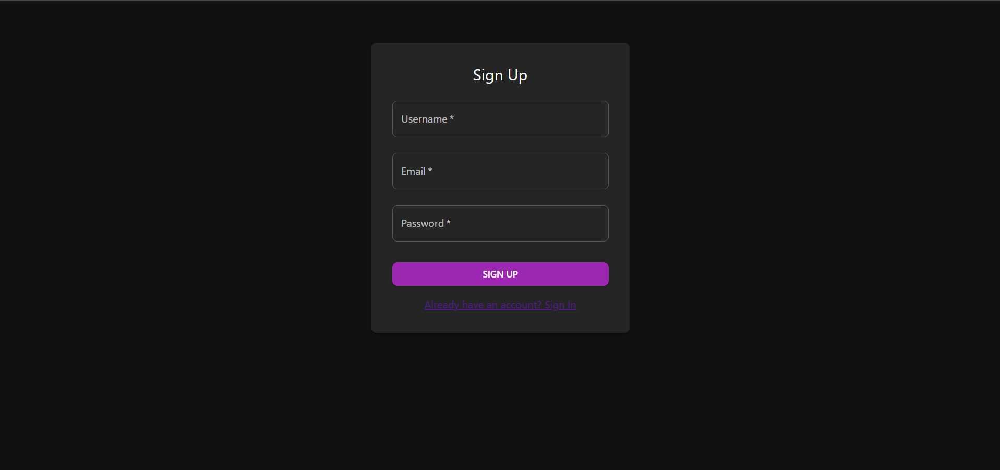
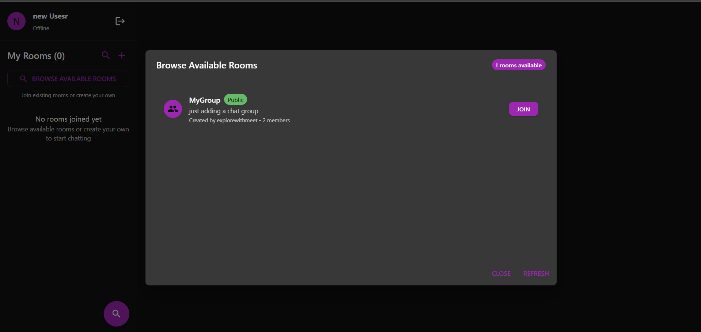
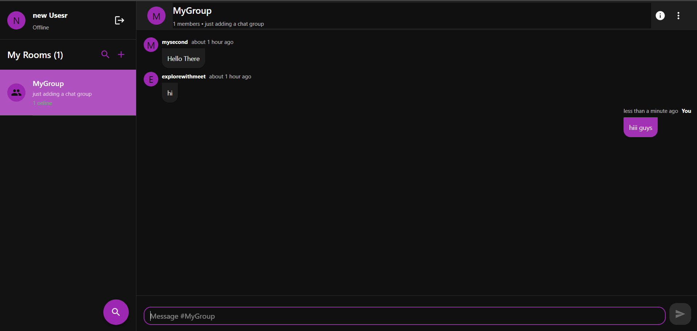
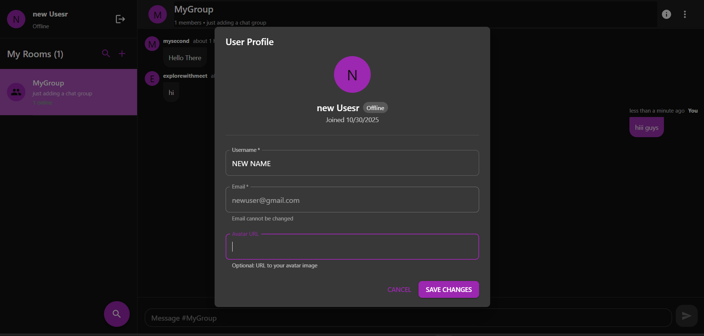

# Real-Time Chat Application with Rooms

A modular, full-stack real-time chat application built with **NestJS** and **React**. Features multi-room chat functionality, JWT authentication, WebSocket real-time messaging, and persistent storage with PostgreSQL.

## Overview

This is a feature-rich chat application that allows users to create, join, and participate in multiple chat rooms with real-time messaging capabilities. Built following NestJS modular architecture principles for scalability and maintainability.

## Key Features

- **Multi-Room Chat**: Create, join, and manage multiple chat rooms
- **Real-Time Messaging**: Instant message delivery using Socket.io WebSocket events
- **User Authentication**: Secure JWT-based authentication with bcrypt password hashing
- **Room Management**: Create private/public rooms, manage room members, room settings
- **Message Operations**: Send, edit, and delete messages with persistent history
- **Typing Indicators**: Real-time typing status notifications
- **User Presence**: Online/offline status tracking
- **Modern UI**: Responsive Material-UI design for desktop and mobile
- **Modular Architecture**: Clean separation of concerns with NestJS modules

## Screenshots

<table>
  <tr>
    <td width="50%">
      
      <p align="center"><b>Login Page</b></p>
    </td>
    <td width="50%">
      
      <p align="center"><b>Chat Rooms List</b></p>
    </td>
  </tr>
  <tr>
    <td width="50%">
      
      <p align="center"><b>Real-Time Chat Interface</b></p>
    </td>
    <td width="50%">
      
      <p align="center"><b>Create Room Modal</b></p>
    </td>
  </tr>
</table>

## Tech Stack

### Frontend

- **React 18** - UI library
- **TypeScript** - Type safety and better DX
- **Material-UI (MUI v5)** - Component library with theming
- **React Hook Form** - Efficient form state management
- **Axios** - HTTP client with interceptors
- **Socket.io Client v4.7** - WebSocket communication
- **React Router v6** - Client-side routing
- **date-fns v2.30** - Date manipulation and formatting
- **Yup & @hookform/resolvers** - Schema validation

### Backend

- **NestJS v10** - Progressive Node.js framework with TypeScript
- **TypeORM v0.3** - Object-relational mapping for database operations
- **PostgreSQL** - Relational database
- **Socket.io v4.7** - Real-time bidirectional communication
- **Passport v0.6** - Authentication middleware
  - Passport-JWT - JWT strategy
  - Passport-Local - Local strategy for login
- **JWT (@nestjs/jwt)** - Secure token-based authentication
- **bcryptjs** - Password hashing and comparison
- **Class Validator & Class Transformer** - DTO validation and transformation
- **Jest** - Testing framework
- **Prettier & ESLint** - Code formatting and linting

## Project Structure

```
chat-app/
├── frontend/                          # React SPA
│   ├── src/
│   │   ├── components/               # Reusable UI components
│   │   ├── pages/                    # Page components
│   │   ├── contexts/                 # Auth & Chat Context
│   │   ├── services/                 # API and Socket.io services
│   │   ├── types/                    # Types of Rooms, Messages, etc...
│   │   ├── App.css
│   │   ├── App.tsx
│   │   ├── index.css
│   │   └── index.tsx
│   ├── public/
│   ├── tsconfig.json
│   └── package.json
│
├── backend/                           # NestJS Application
│   ├── src/
│   │   ├── auth/                     # Authentication module
│   │   │   ├── dto/
│   │   │   │  ├── login.dto.ts
│   │   │   │  └── register.dto.ts
│   │   │   ├── guards/
│   │   │   │  ├── jwt-auth.guard.ts
│   │   │   │  └── local-auth.guard.ts
│   │   │   ├── strategies/
│   │   │   │  ├── jwt.strategy.ts
│   │   │   │  └── local.strategy.ts
│   │   │   ├── auth.controller.ts
│   │   │   ├── auth.service.ts
│   │   │   └── auth.module.ts
│   │   │
│   │   ├── users/                    # Users module
│   │   │   ├── dto/
│   │   │   │  ├── create-user.dto.ts
│   │   │   │  └── update-user.dto.ts
│   │   │   ├── entities/
│   │   │   │  └── user.entity.ts
│   │   │   ├── users.controller.ts
│   │   │   ├── users.service.ts
│   │   │   └── users.module.ts
│   │   │
│   │   ├── rooms/                    # Rooms module
│   │   │   ├── dto/
│   │   │   │  ├── create-room.dto.ts
│   │   │   │  ├── join-room.dto.ts
│   │   │   │  └── update-room.dto.ts
│   │   │   ├── entities/
│   │   │   │  ├── room-member.dto.ts
│   │   │   │  └── room.entity.ts
│   │   │   ├── rooms.controller.ts
│   │   │   ├── rooms.service.ts
│   │   │   └── rooms.module.ts
│   │   │
│   │   ├── chat/                     # Chat & WebSocket module
│   │   │   ├── dto/
│   │   │   │  └── create-message.dto.ts
│   │   │   ├── entities/
│   │   │   │  └── message.entity.ts
│   │   │   ├── chat.gateway.ts       # WebSocket gateway
│   │   │   ├── chat.service.ts
│   │   │   ├── chat.controller.ts
│   │   │   └── chat.module.ts
│   │   │
│   │   ├── app.module.ts
│   │   └── main.ts
│   ├── tsconfig.json
│   └── package.json
│
└── README.md
```

## API Endpoints

### Authentication Module

- `POST /api/auth/register` - Register new user
- `POST /api/auth/login` - Login and receive JWT token

### Users Module

- `GET /api/users` - Get all users
- `GET /api/users/me` - Get current authenticated user
- `GET /api/users/:id` - Get user by ID
- `POST /api/users` - Create new user
- `PATCH /api/users/:id` - Update user profile
- `DELETE /api/users/:id` - Delete user account

### Rooms Module

- `GET /api/rooms` - List all available rooms
- `GET /api/rooms/my-rooms` - Get user's joined rooms
- `GET /api/rooms/:id` - Get room details
- `GET /api/rooms/:id/members` - Get room members
- `POST /api/rooms` - Create new room
- `POST /api/rooms/:id/join` - Join a room
- `DELETE /api/rooms/:id/leave` - Leave a room
- `PATCH /api/rooms/:id` - Update room settings
- `DELETE /api/rooms/:id` - Delete room (owner only)

### Chat Module

- `GET /api/chat/rooms/:roomId/messages` - Get room message history
- `POST /api/chat/messages` - Send message
- `PATCH /api/chat/messages/:id` - Edit message
- `DELETE /api/chat/messages/:id` - Delete message

## WebSocket Events

### Client → Server

| Event         | Payload                         | Description          |
| ------------- | ------------------------------- | -------------------- |
| `joinRoom`    | `{ roomId, userId }`            | Join a chat room     |
| `leaveRoom`   | `{ roomId, userId }`            | Leave a chat room    |
| `sendMessage` | `{ roomId, content, senderId }` | Send message to room |
| `typing`      | `{ roomId, userId, isTyping }`  | Notify typing status |

### Server → Client

| Event              | Payload                              | Description          |
| ------------------ | ------------------------------------ | -------------------- |
| `message:new`      | `{ id, content, sender, timestamp }` | New message received |
| `message:updated`  | `{ id, content, editedAt }`          | Message was edited   |
| `message:deleted`  | `{ id }`                             | Message was deleted  |
| `typing:indicator` | `{ userId, isTyping }`               | User typing status   |
| `user:joined`      | `{ userId, username }`               | User joined room     |
| `user:left`        | `{ userId, username }`               | User left room       |

## Getting Started

### Prerequisites

- Node.js v16+
- PostgreSQL v12+
- npm or yarn

### Backend Setup

1. Navigate to backend directory:

   ```bash
   cd backend
   ```

2. Install dependencies:

   ```bash
   npm install
   ```

3. Create `.env` file:

   ```env
   # Database
   DATABASE_HOST=localhost
   DATABASE_PORT=5432
   DATABASE_NAME=chat_app_db
   DATABASE_USER=postgres
   DATABASE_PASSWORD=your_password

   # Server
   NODE_ENV=development
   PORT=3001

   # JWT
   JWT_SECRET=your_super_secret_jwt_key
   JWT_EXPIRATION=7d
   ```

4. Run database migrations (if using migrations):

   ```bash
   npm run typeorm:migration:run
   ```

5. Start development server:

   ```bash
   npm run start:dev
   ```

   Backend runs on `http://localhost:3001`

### Frontend Setup

1. Navigate to frontend directory:

   ```bash
   cd frontend
   ```

2. Install dependencies:

   ```bash
   npm install
   ```

3. Create `.env` file:

   ```env
   REACT_APP_API_URL=http://localhost:3001
   ```

4. Start development server:

   ```bash
   npm start
   ```

   Frontend opens at `http://localhost:3000`

## Available Scripts

### Backend

```bash
npm run start           # Start production server
npm run start:dev       # Start with hot reload
npm run build           # Build for production
npm run start:prod      # Run production build
npm run test            # Run unit tests
npm run test:watch      # Run tests in watch mode
npm run test:cov        # Generate coverage report
npm run test:e2e        # Run end-to-end tests
npm run lint            # Fix linting issues
npm run format          # Format code with Prettier
```

### Frontend

```bash
npm start               # Start development server
npm run build           # Build for production
npm test                # Run tests
npm run eject           # Eject from create-react-app
```

## Module Architecture

The backend follows NestJS modular architecture:

### Auth Module

Handles user authentication using JWT and Passport strategies. Provides login/register endpoints and JWT guards for protected routes.

### Users Module

Manages user profiles, CRUD operations, and user data persistence. Includes user validation and transformation DTOs.

### Rooms Module

Manages chat room creation, joining, leaving, and room member management. Handles room permissions and settings.

### Chat Module

Core real-time messaging functionality via WebSocket gateway. Handles message CRUD operations, message persistence, and real-time events (typing indicators, user presence).

### Common Module

Shared utilities including JWT guards, custom decorators, and interceptors for cross-cutting concerns.

## Database Schema

### Users Table

- `id` (UUID, PK)
- `username` (VARCHAR, unique)
- `email` (VARCHAR, unique)
- `password` (VARCHAR, hashed)
- `createdAt` (TIMESTAMP)
- `updatedAt` (TIMESTAMP)

### Rooms Table

- `id` (UUID, PK)
- `name` (VARCHAR)
- `description` (TEXT)
- `ownerId` (UUID, FK)
- `isPrivate` (BOOLEAN)
- `createdAt` (TIMESTAMP)
- `updatedAt` (TIMESTAMP)

### Messages Table

- `id` (UUID, PK)
- `content` (TEXT)
- `roomId` (UUID, FK)
- `senderId` (UUID, FK)
- `editedAt` (TIMESTAMP, nullable)
- `createdAt` (TIMESTAMP)

### RoomMembers Table

- `id` (UUID, PK)
- `roomId` (UUID, FK)
- `userId` (UUID, FK)
- `joinedAt` (TIMESTAMP)

## Testing

### Run Unit Tests

```bash
cd backend
npm run test
```

### Run with Coverage

```bash
cd backend
npm run test:cov
```

### Run E2E Tests

```bash
cd backend
npm run test:e2e
```

## Deployment

### Backend Deployment

1. Build application:

   ```bash
   npm run build
   ```

2. Set environment variables in production environment

3. Run migrations:

   ```bash
   npm run typeorm:migration:run
   ```

4. Start server:
   ```bash
   npm run start:prod
   ```

### Frontend Deployment

1. Build application:

   ```bash
   npm run build
   ```

2. Deploy `build` folder to:
   - Netlify
   - Vercel
   - AWS S3 + CloudFront
   - GitHub Pages
   - Any static hosting service

## Development Workflow

1. Create feature branch: `git checkout -b feature/room-search`
2. Make changes following modular architecture
3. Run linting: `npm run lint`
4. Format code: `npm run format`
5. Run tests: `npm run test`
6. Commit with clear message: `git commit -m 'feat: add room search functionality'`
7. Push and create Pull Request

## Contributing

We welcome contributions! Please:

1. Fork the repository
2. Create feature branch (`git checkout -b feature/amazing-feature`)
3. Follow NestJS/React best practices
4. Add tests for new features
5. Commit changes (`git commit -m 'feat: add feature'`)
6. Push to branch (`git push origin feature/amazing-feature`)
7. Open Pull Request

## License

This project is licensed under the MIT License.

## Future Enhancements

- [ ] Private direct messages between users
- [ ] Room search and filtering
- [ ] Message reactions and emojis
- [ ] File and image sharing
- [ ] Voice/video chat integration
- [ ] Message pinning
- [ ] User roles and permissions
- [ ] Room invitations
- [ ] Message search within rooms
- [ ] User blocking functionality
- [ ] Message encryption
- [ ] Read receipts and last seen status

## Support

For issues, questions, or suggestions, open an issue on GitHub.

---

**Built with NestJS, React, TypeORM, Socket.io, and PostgreSQL** 🚀
